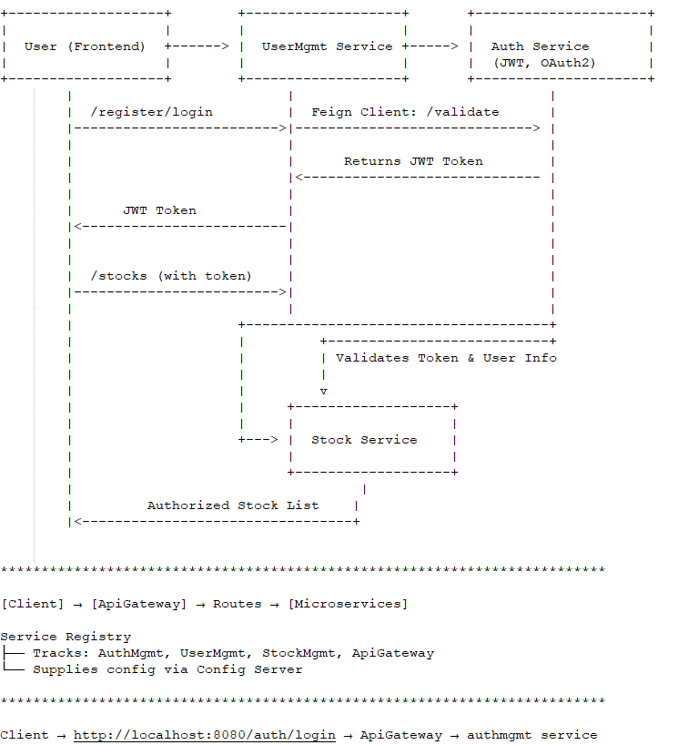
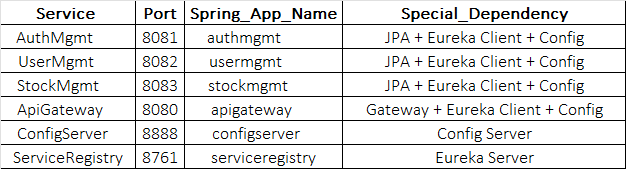

****************************************************************************

**************************************************************************

Matching Logic while fetching and applying Configurations(Resolution Order)
- authmgmt-default.properties
- authmgmt.properties (if no profile-specific file exists)
- application-default.properties (shared fallback)
- application.properties

**************************************************************************

Runs with Java 17
For building all microservices - go to base branch
.\gradlew clean build

For Building Individually
.\gradlew :ConfigServer:clean :ConfigServer:build

**************************************************************************

**************************************************************************

**************************************************************************